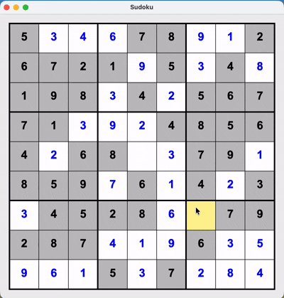

# Sudoku

A fully functional Sudoku game built in Java with a graphical user interface.



## Features

- **Board generation** — unique puzzles generated by shuffling a seed board and removing cells, validated with a backtracking algorithm to ensure solvability
- **MVC architecture** — clear separation between game logic (model), rendering (view), and input handling (controller)
- **Win detection** — the game recognizes when the board is correctly solved

## Tech Stack

- Language: Java
- GUI: Java Swing
- Build system: Maven

## Project Structure

```
src/
├── main/java/no/uib/inf101/sample/
│   ├── controller/
│   │   └── SudokuController.java      # Handles keyboard and mouse input
│   ├── datastructure/
│   │   ├── CellPosition.java
│   │   ├── CellPositionToPixelConverter.java
│   │   ├── Grid.java
│   │   ├── GridCell.java
│   │   ├── GridDimension.java
│   │   └── IGrid.java
│   ├── model/
│   │   ├── SudokuBoardGenerator.java  # Board generation and backtracking
│   │   ├── SudokuCell.java
│   │   └── SudokuModel.java           # Game logic
│   ├── view/
│   │   └── SudokuView.java            # Rendering and UI
│   └── Main.java                      # Entry point
└── test/                              # Unit tests
```

## How to Run

**Prerequisites:** Java 17+, Maven

```bash
git clone https://github.com/jakobthoresen/Sudoku.git
cd sudoku-java
mvn compile exec:java -Dexec.mainClass="no.uib.inf101.sample.Main"
```

## How to Play

- Click a cell to select it
- Type a number (1–9) to fill it in
- Backspace to clear a cell
- The game notifies you when the puzzle is solved
