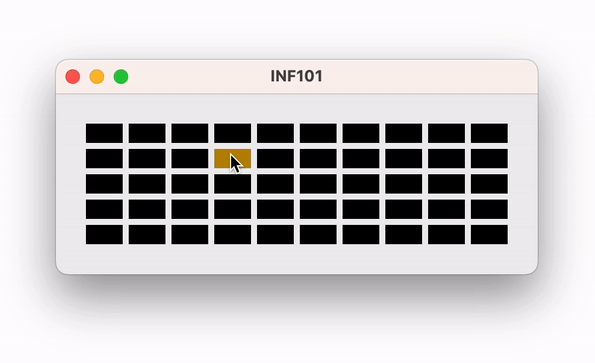

# Eksempel på klikking i ruter

I dette eksempelet har [CellPositionToPixelConverter](./src/main/java/no/uib/inf101/sample/CellPositionToPixelConverter.java) fått en metode som oversetter «baklengs» fra punkt til rute, slik at man kan regne om fra museklikk til rad og kolonne i rutenettet.

Konverteringsobjektet blir opprettet i [visningen](./src/main/java/no/uib/inf101/sample/View.java). [Kontrolleren](./src/main/java/no/uib/inf101/sample/Controller.java) får tilgang til konvertereren ved å kalle en metode på visningen.

